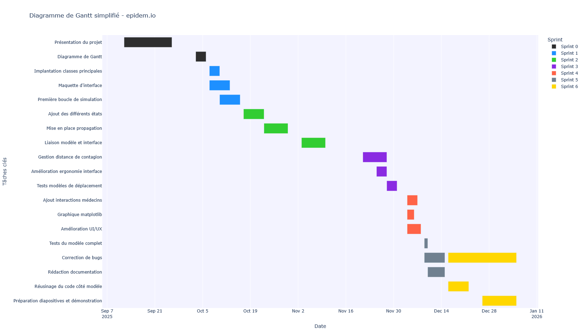

# epidem.io

## Description du projet
Ce projet est un outil de simulation permettant de suivre la propagation d'une épidémie de manière paramétrique, de façon réaliste, dans une interface qui se veut simple et explicite.

Voici l'adresse du dépôt contenant le code source : https://github.com/AdrienVerstrepen/epidem.io

## Installation et lancement
### Exécutable
Des fichiers exécutables sont fournis pour les systèmes Linux et Windows.
Ils sont disponibles dans l'onglet "release" sur github.
Ces fichiers sont des exécutables indépendants permettant l'exécution de l'application.

### Python
Pour lancer l'application avec python, il faut récupérer le code source :
```
git clone https://github.com/AdrienVerstrepen/epidem.io && cd epidem.io
```
Vous pouvez ensuite installer les modules nécessaire avec 
```
python -m pip install -r requirements.txt
```
Puis vous pouvez lancer le programme avec : 
```
python -m src.ihm
```

## Fonctionnalités
* Simulation de la propagation d'épidémie en fonction de différents paramètres :
   * **Indicateurs de population** : Effectif total, pourcentage d'immunodéprimés, nombre de médecins (influence la survie à proximité).
   * **Indicateurs de maladie** : Risque de transmission, taux de létalité, distance d'infection, immunité après guérison, temps de guérison.
   * **Indicateurs de simulation** : Nombre de patients 0, vitesse de déplacement.
* Suivi de la propagation :
   * Les personnes sont représentées par quatre états : sain (vert), infecté (orange), mort (rouge), immunisé (bleu).
   * Vous pouvez suivre l'évolution du nombre de personnes mortes au cours de la simulation dans l'onglet statistiques.

## Organisation du projet

Voici le diagramme de Gantt, illustrant la répartition des tâches, dans le temps et par personne du projet :


### Structure du projet

À la racine du projet, vous retrouverez : 
* ce fichier
* deux dossiers dont voici une courte descriptions

Le dossier doc contient les différents documents liés à la documentation du projet : 
* Cahier des charges
* Documentation
* Diagramme de classe
* Diagramme de Gantt

Le dossier src contient le code source du projet :
* Package view
* Package algorithmie
* Exécutables
* Images
* Tests

### Tests et couverture
Des tests sont disponibles pour vérifier le bon fonctionnement des algorithmes. Pour les lancer, entrez les commandes suivantes dans le terminal à la racine du projet :
* `coverage run -m pytest` : exécute la suite de tests.
* `coverage report -m` : affiche le rapport pour savoir si les tests sont réussis et si tout le code est couvert.

### Guide d'utilisation :
Lorsque vous lancez l'application, un petit texte vous est affiché.
Ce texte vous explique les détails auxquels il faudra faire attention lors du suivi
de l'évolution de la simulation. 

L'interface est composée de 3 sections :
1. La zone de menu avec 5 boutons. Ils servent à intéragir avec le moteur de simulation et à afficher les statistiques
2. La zone des paramètres. Composé de deux groupes : les paramètres dont la mise à jour sera prise en compte au lancement de la prochaine simulation et les paramètres dont la mise à jour sera prise en compte à la prochaine itération.
3. La visualisation de la simulation. Elle comporte la grille où notre population et son épidémie évoluera. 

***
> Auteurs : Athène Rousseau-Rambach & Adrien Verstrepen